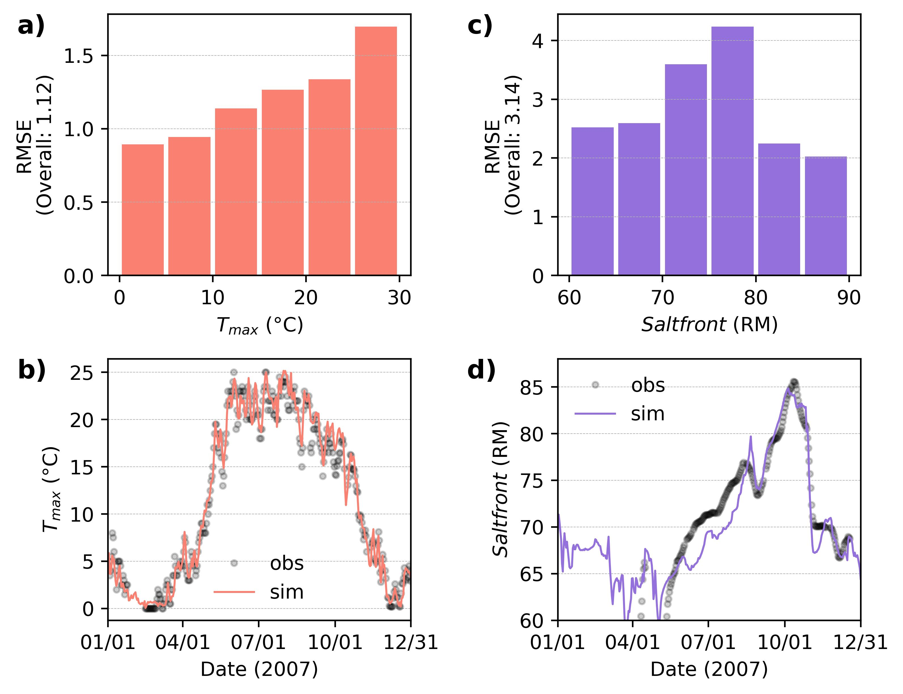

# PywrDRB-ML
ML plugin for water temperature and salt front prediction.

# Run Coupled Pywr-DRB 
Coupled Pywr-DRB = [Pywr-DRB v2.0](https://github.com/Pywr-DRB/Pywr-DRB) + PywrDRB-ML plugin

See the demo in `Tutorial 05 Run Coupled PywrDRB.ipynb`. 

Note: Please install [Pywr-DRB v2.0](https://github.com/Pywr-DRB/Pywr-DRB) first, which contains all dependencies to run the Coupled Pywr-DRB. Then clone this repo to run `run_coupled_pywrdrb.py`. In `Tutorial 05 Run Coupled PywrDRB.ipynb` or `run_coupled_pywrdrb.py`, you need to change `root_dir` to your directory of cloned `PywrDRB-ML`.

The figure below show you the snapshot of the trained LSTMs performance.

Model evaluation of daily maximum stream temperature at Lordville ($T_max$) and 7-day average salt front location in the estuary ($Saltfront$) dynamics in the DRB from 1979 to 2023. a) and c) shows Root Mean Square Error (RMSE) across different ranges of T_max and Saltfront, respectively. b) and d) present time series comparison of observed (obs; dots) and simulated (sim; solid lines) T_max and Saltfront in 2007.

# Data availability 
Designed to run until 2023 as the reconstruction data end at 2023.
| Data            | From        | Note |
|-----------------|-------------|------|
| GridMET     | 1/1/1979|      |
| T_C             | 10/1/1975   | Filled by reservoir_io_sntemp.csv (pretrain) or LSTM outputs |
| Tmax_C          | 10/1/1963   |      |
| Q_C             | 10/1/1963   |      |
| T_L             | 10/1/1992   | Filled by dwallin_stream_preds.csv (pretrain) or LSTM outputs |
| Tmax_L          | 10/1/1992   |      |
| Q_L             | 7/28/2006   |      |
| dwallin_temp_c  | 4/1/1982    |      |
| Saltfront   |10/1/1963|      |
| 01463500        | 10/1/1963   |      |
| 01474500        | 10/1/1963   |      |

# Designed LSTMs' capability
| Coupled Version | From        | Note |
|-----------------|-------------|------|
| TempLSTM        | 1/1/1979    | Constrained by meterological inputs (gridmet)|
| SalinityLSTM    | 10/1/1963   | Constrained by saltfront location data if choosed to have lag 1 as an input|

| Observed Version| From        | Note |
|-----------------|-------------|------|
| TempLSTM        | 7/28/2006   | Constrained by observed flow at Lordville|
| SalinityLSTM    | 10/3/1963   | Constrained by saltfront location data if choosed to have lag 1 as an input|

# Raw data preparation
## Observed data download from API
- `src/data_retrievel/pull_gridmet.py`: Downloads and processes GridMET meteorological data for use as model input features.
    - `data\raw\gridmet_lordville.csv`
- `src/pull_nwis.py`: Downloads and processes streamflow and water quality data from the USGS National Water Information System (NWIS) for use as model input or validation data.
    - `data\raw\nwis_Cannonsville_degC_mgd.csv`
    - `data\raw\nwis_Lordville_degC_mgd.csv`
    - `data\raw\salt_front_data.csv`

## Below files are directly downloaded from webpage or copied from the given sources.

- `data\raw\sf_data.xlsx (.csv)` 
    - https://drbc.net/Sky/hydro/saltfront.html#header2

- `data\raw\drb_reservoir_storage_mg_2000_2024.csv`
    - from Marylin (should be identical to what we have in pywrdrb)

## Pywrdrb-simulated data
- `src/data_retrievel/pull_pywrdrb_simulated_data.py`
    - Simulate `pub_nhmv10_BC_withObsScaled`, the reconstruction data (median).
    - from 1945 - 2023

# Creating database for LSTM training
## TempLSTM
- `src\form_TempLSTM_db\use_lstm_to_fill_gaps.py`
    - `data\raw\lstm_simed_T_degC.csv`
    - later use this to fill gaps if linearly interpolate over 3 consecutive days
- `src/form_TempLSTM_db/decompose_Ti_Qi.py`
    - `data\decomposed_Ti_Qi\df_QobsTavg.csv`
    - `data\decomposed_Ti_Qi\df_QbcTavg.csv`
    - `data\decomposed_Ti_Qi\df_QobsTmax.csv`
    - `data\decomposed_Ti_Qi\df_QbcTmax.csv`
- `src\form_TempLSTM_db\create_TempLSTM_database.py`
    - `data\database\TempLSTM_database.csv`

## SalinityLSTM
- `src\form_SalinityLSTM_db\create_SalinityLSTM_database.py`
    - `data\database\SalinityLSTM_database.csv`

# LSTM-related scripts (adopted from Jake)
- `src/prep_data_utils.py`: Utility functions for data preparation and preprocessing.
- `src/prep_data.py`: Main script for preparing datasets, likely orchestrates data loading and processing.
- `src/torch_bmi.py`: Implements BMI (Basic Model Interface) integration for PyTorch models.
- `src/torch_models.py`: Defines PyTorch model architectures, including LSTM models for temperature and salinity prediction.
- `src/sampling_utils.py`: Provides sampling functions for uncertainty quantification in LSTM model outputs, such as sampling from Gaussian Mixture Models (GMM).
- `src/training_utils.py`: Contains training utilities for LSTM models, including custom loss functions (e.g., MaskedGMMLoss, MaskedCMALLoss, MaskedUMALLoss), evaluation metrics (such as rmse_masked), and model fitting routines (e.g., fit_torch_model).

# Model training
- `lstm_train_TempLSTM.py`
    - Create model, train model, basic analysis
- `lstm_train_SalinityLSTM.py`
    - Create model, train model, basic analysis